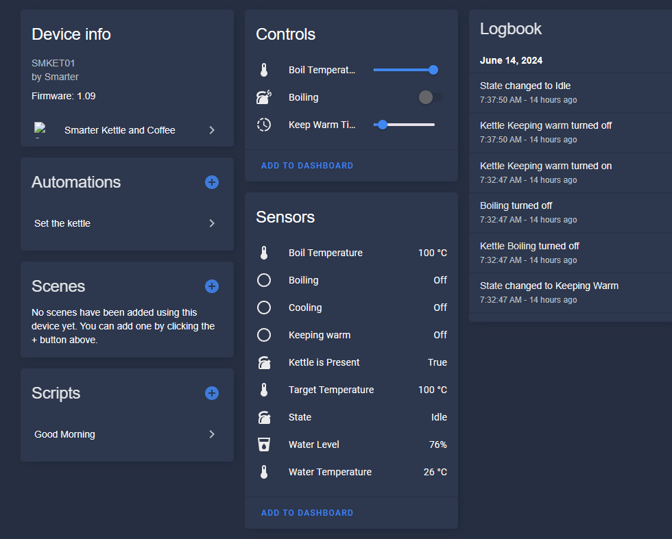

# Smarter Kettle and Coffee integration

[![GitHub Release][releases-shield]][releases]
[![GitHub Activity][commits-shield]][commits]
[![License][license-shield]](LICENSE)

[![pre-commit][pre-commit-shield]][pre-commit]
[![Black][black-shield]][black]

[![hacs][hacsbadge]][hacs]
[![Project Maintenance][maintenance-shield]][user_profile]
[![BuyMeCoffee][buymecoffeebadge]][buymecoffee]

Note: At the moment, this integration supports only Smarter Kettle V3, as that is the only device I possess. The platform upon which this integration is built is capable of supporting other devices, and if you have come here with the desire to integrate another device from Smarter into your Home Assistant, please contact me by creating an Issue on this repository. With your help, I may be able to support your device as well. Kettle V1 and V2 use a different technology, and will not be supported.

**This component will set up the following entities.**

| Platform        | Entity             | Description                                                                                                                         |
| --------------- | ------------------ | ----------------------------------------------------------------------------------------------------------------------------------- |
| `binary_sensor` | Boiling            | `On` if kettle is currently heating water                                                                                           |
| `binary_sensor` | Cooling            | `On` if kettle has warmed water and is allowing it to cool, such as for formula mode                                                |
| `binary_sensor` | Keeping Warm       | `On` if kettle has warmed water and will keep it warm                                                                               |
| `sensor`        | Water Temperature  | Current temperature of water                                                                                                        |
| `sensor`        | Boil Temperature   | Temperature for the next "boil" command                                                                                             |
| `sensor`        | Target Temperature | Current target temperature 1                                                                                             |
| `sensor`        | State              | Current state of Kettle as reported by the API                                                                                      |
| `sensor`        | Kettle is Present  | Whether the kettle is on the base                                                                                                   |
| `sensor`        | Water Level        | Current water level 2                                                                                                    |
| `switch`        | Boiling            | Set `On` to boil to target temperature. Set `Off` to turn off boiling / keep-warm. State will remain `On` while keep-warm is active |
| `number`        | Boil Temperature   | Same as the sensor, but allows setting                                                                                              |
| `number`        | Keep Warm Time     | Allows you to set the time for which kettle will continue to heat water                                                             |

Notes:

1 If you run a boil program, then change the boil temperature while water is being heated, your target temperature will reflect the current boil command, and the target temperature will reflect the new temperature. This comes from the Smarter API and can be observed on their app too.

2 May not always be correct. The kettle requires periodic calibration, but in my experience, this isn't all that accurate. It's probably for this reason that the first-party app gives a big range in terms of the volume of water available.

## Installation
### HACS

The recommended and easiest installation option is via the [Home Assistant Community Store
(HACS)](https://hacs.xyz/). After HACS is installed, you may install this integration in one of two ways. If your Home Assistant instance is set up with the `my` integration for link forwarding, you may use the button below to automatically be taken to the install page for this integration. Otherwise, please follow the [instructions for adding a custom
repository](https://hacs.xyz/docs/faq/custom_repositories). When the integration is installed, it may be configured from the UI, the same way as first party integrations.

### Manual

If you do not wish to use HACS, you may follow the instructions below. This installation method will not provide you with updates, and you will have to perform these steps each time you want to install an updated version.

1. Using the tool of choice open the directory (folder) for your HA configuration (where you find `configuration.yaml`).
2. If you do not have a `custom_components` directory (folder) there, you need to create it.
3. In the `custom_components` directory (folder) create a new folder called `smarter`.
4. Download _all_ the files from the `custom_components/smarter/` directory (folder) in this repository.
5. Place the files you downloaded in the new directory (folder) you created.
6. Restart Home Assistant
7. In the HA UI go to "Configuration" -> "Integrations" click "+" and search for "Smarter Kettle and Coffee integration"

Using your HA configuration directory (folder) as a starting point you should now also have this:

## Configuration
At this time, the only configuration provided is the ability to log in with your credentials.

## Roadmap
This integration is two parts. The underlying [smarter-client library](https://www.github.com/kbirger/smarter-client) and this integration, both of which are developed by me. For simplicity, the roadmap below encompasses planned features for both.

### General
- Better documentation: My time right now is somewhat limited, but I recognize that this is lacking
- Better testing: As above. In the interest of getting something out, and getting some testers, I have not finished fully testing everything.
- Consistent linting, testing, and other config

### Library-specific (technical)

- Native support for asynchio: for now, since the underlying firebase api does not support Coroutines, I am using the executor in HA. As time allows, I will investigate if this is the best solution, and perhaps provide async support directly int the library instead
- Better abstractions: This project started with me hacking away and doing a POC. The approach I took at first is one that I recognize is ultimately sub-optimal. The library needs to be cleaned up prior to v1.0
- Logging support: I need to provide a way to log to the HA log from the library.
- Expose session events: The library should notify the extension when session is updated/refreshed, so that refresh token can be updated, etc.
- Support starting session from refresh token
- Event callbacks for when kettle state changes: currently, this is done implicitly by entiy state changes, but more things could be done if the library explicitly notifies of these events.
- Calibration detection and calibrate functionality: detect when kettle needs calibration and provide interface for calling calibration

### Integration
- Start extension from refresh token: If one is available, avoid sending credentials over the wire
- Network configuration: Currently, the integration will crawl all networks ("Homes") in your account, and provide those devices. I will eventually add an explicit network configuration flow
- Device opt-in flow and config entry per device: I am on the fence here, but leaning towards providing a config entry per device, because some configurations may be beneficial to expose on a per-device basis
- Formula mode support
- Alarms Support: to be honest, not 100% sure what this is in the base API. It might be how notifications are performed.
- Services for sending commands such as boil: right now this is achieved through the `switch` entity, but services would also be convenient and allow for some interesting posibilities, such as custom preset buttons
- Add / Test unload and reload support
- Custom controls: Need to research this a bit more. I'm not sure if this is something that would require a dedicated platform. Currently, some devices, such as vacuums, can provide controls
- Secure credential storage: Currently the extension stores username and password. I'm not happy about this, but have not had time to research something better. If you know the best way to do this, please create an Issue. One possibility is that your credentials will only be used once, to store the refresh token. This may result in needing to periodically reauthenticate, but not 100% sure.
- Add events: honestly, this one is a maybe. Seems like a small nice to have, since entities already provide events. If anyone feels that this would be useful, please create an Issue in the tracker and state your use-case.
- Create UI card: Maybe? Not sure if this is helpful

## Contributions are welcome!

If you want to contribute to this please read the [Contribution guidelines](CONTRIBUTING.md)

## Credits

This project was generated from [@oncleben31](https://github.com/oncleben31)'s [Home Assistant Custom Component Cookiecutter](https://github.com/oncleben31/cookiecutter-homeassistant-custom-component) template.

Code template was mainly taken from [@Ludeeus](https://github.com/ludeeus)'s [integration_blueprint][integration_blueprint] template

---

[integration_blueprint]: https://github.com/custom-components/integration_blueprint
[black]: https://github.com/psf/black
[black-shield]: https://img.shields.io/badge/code%20style-black-000000.svg?style=for-the-badge
[commits-shield]: https://img.shields.io/github/commit-activity/y/kbirger/ha-smarter-integration.svg?style=for-the-badge
[commits]: https://github.com/kbirger/ha-smarter-integration/commits/main
[hacs]: https://hacs.xyz
[hacsbadge]: https://img.shields.io/badge/HACS-Custom-orange.svg?style=for-the-badge
[forum-shield]: https://img.shields.io/badge/community-forum-brightgreen.svg?style=for-the-badge
[forum]: https://community.home-assistant.io/
[license-shield]: https://img.shields.io/github/license/kbirger/ha-smarter-integration.svg?style=for-the-badge
[maintenance-shield]: https://img.shields.io/badge/maintainer-%40kbirger-blue.svg?style=for-the-badge
[pre-commit]: https://github.com/pre-commit/pre-commit
[pre-commit-shield]: https://img.shields.io/badge/pre--commit-enabled-brightgreen?style=for-the-badge
[releases-shield]: https://img.shields.io/github/release/kbirger/ha-smarter-integration.svg?style=for-the-badge
[releases]: https://github.com/kbirger/ha-smarter-integration/releases
[user_profile]: https://github.com/kbirger
